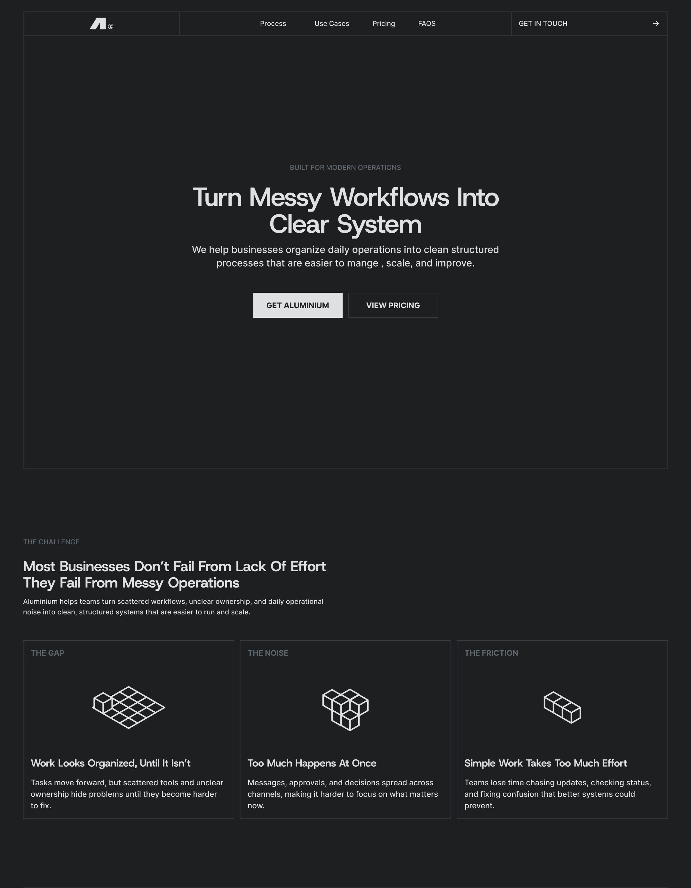

# Aluminium

Aluminium is a structured operations landing page for teams that need clearer workflows, stronger ownership, and simpler ways to manage daily work.

The site presents the product, explains operational challenges, shows a process walkthrough, lists use cases, includes pricing cards with Stripe checkout, and gives users a contact form for reaching out.

## Live Demo

https://aluminiumgrid.vercel.app/

## Overview

Aluminium was built to make operational work feel clearer and more organized. Many teams deal with scattered tasks, unclear responsibilities, repeated follow-ups, and messy approval flows. Aluminium positions those problems as workflows that can be mapped, structured, and managed through a calmer process system.

The app is designed as a polished product page with a strong visual system, smooth navigation, animated UI details, pricing interactions, and a contact request modal. Users can move through the sections, compare plans, open the contact form, select a meeting date and time, and submit a request.

## Features

- Interactive hero section with a themed dot-field background.
- Primary call-to-action that opens the contact request modal.
- Pricing call-to-action that scrolls directly to the pricing section.
- Sticky navigation with section links for Operations, Use Cases, Pricing, and FAQS.
- Clickable navigation logo that returns users to the top of the page.
- Footer navigation links for Challenges, Process, Use Cases, and Pricing.
- Smooth page scrolling behavior powered by Framer Motion.
- Challenge section that explains common operational problems.
- Scroll-driven process showcase with step-based visuals and active-state updates.
- Use case section for workflow-heavy teams, client-service companies, founders, and operations teams.
- Structured flow timeline that highlights staged workflow improvement.
- Pricing cards with monthly and yearly billing controls.
- Stripe checkout API route for paid plan checkout.
- Contact request modal with a smooth animated open and close transition.
- Contact form with first name, last name, email, date, time, and message inputs.
- Custom contact calendar with unavailable dates and scrollable time slots.
- Success state after form submission with automatic modal close after three seconds.
- Theme toggle with light, dark, and blue visual modes.
- Footer social-link placeholder popup that disappears after three seconds.
- Reusable component structure organized into atoms, molecules, organisms, and UI components.

## Tech Stack

- Next.js 16
- React 19
- TypeScript
- Tailwind CSS 4
- Framer Motion
- Motion
- Stripe
- Vercel Analytics
- Lottie React
- SVGR
- ESLint
- Vercel

## What I Built

- Built the full Aluminium product page around the idea of turning messy operations into structured workflow systems.
- Designed the page flow from hero, challenge, process, use cases, structured flow, pricing, FAQ, and footer.
- Created a reusable design system with atoms, molecules, organisms, and shared UI icon components.
- Built the animated hero background using a custom dot-field canvas component.
- Implemented native hash navigation for page sections so navigation and footer links jump to the correct parts of the page.
- Added a top-of-page logo link in the navigation while preserving the existing theme toggle.
- Built the scroll-driven process section that updates the active process step as the user moves through the page.
- Created pricing cards with monthly and yearly switching.
- Connected pricing cards to a Stripe checkout API route.
- Built the contact request modal with animated entrance and exit states.
- Created the contact form, including text inputs, message input, date selection, and time selection.
- Built the custom contact calendar and matched the time column height to the calendar section.
- Added unavailable-date handling for the calendar.
- Added success feedback after form submission and automatic modal dismissal after three seconds.
- Added footer social-link placeholder feedback for links that are not connected yet.
- Added theme switching across light, dark, and blue modes using CSS variables.
- Preserved the existing visual system while extending behavior through small component-level changes.
- Added Vercel Analytics support for production analytics.

## Getting Started

Clone the repository:

